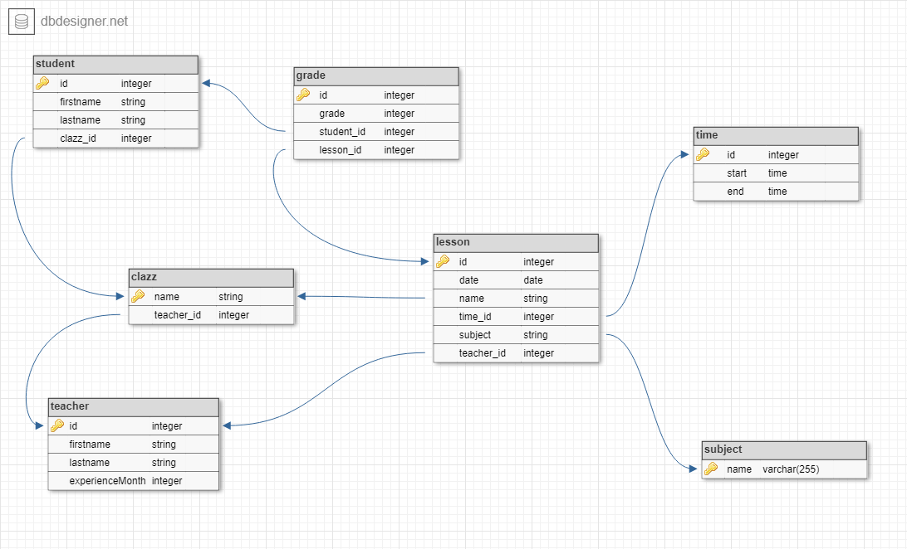

# Java spring Slaveyard server

**Slaveyard client repository** - https://github.com/Darkinowls/slaveyard_client

**Deprecated project I am inspired** - ~~https://github.com/Darkinowls/slaveyard~~

## Database of Slaveyard

To create the database the script is required: [create_psql_database.sql](create_psql_database.sql)

To insert default date into the database the script is required: [insert_psql_data.sql](insert_psql_data.sql)